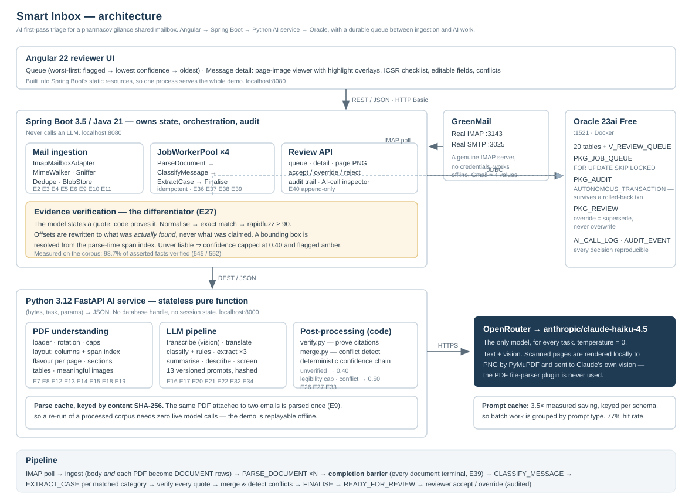

# Smart Inbox

**AI first-pass triage for a pharmacovigilance shared mailbox.**

Reads email and PDF attachments over IMAP, works out what each message is about, extracts the
key facts with a confidence score and a **machine-verified** pointer back to the exact source,
and hands it to a human reviewer to accept or override. Every AI decision and every reviewer
action is written to an audit trail.

> **No real patient data.** Every document in this repository is generated by
> `testdata/generator/` with invented drugs, people and places. The generator is committed and
> re-runnable, so you can see exactly where the data comes from.

---

## What it does, in one screen



The differentiator is **verified provenance**. The obvious implementation makes `source` a
string the model fills in. Models hallucinate citations as readily as facts, and a fabricated
citation in a regulated system is worse than none — it manufactures confidence a reviewer will
act on. So here the model states a quote and **code proves it**: normalise, exact match, then
fuzzy match at ≥ 90 similarity, with the character offsets rewritten to what was *actually*
found. Unverifiable evidence caps the field's confidence at 0.40 and shows the reviewer an
amber chip reading *"cited but not found in source"* — the system reporting its own
hallucinations instead of hiding them.

**Measured on the full 38-message corpus: 99.0% of asserted facts verified (569 / 575).**

---

## Prerequisites

| | Version | Notes |
|---|---|---|
| Docker Desktop | 20+ | Oracle needs ~2 GB; allow 4 GB total |
| Java | 21+ | Builds with `--release 21`; tested on JDK 24 |
| Python | 3.12 | |
| Node | **≥ 22.22.3** or 24 LTS | Angular 22's own requirement — only needed to rebuild the UI |
| Maven / Angular CLI | — | **not required**, `./mvnw` and `npx` handle it |
| Tesseract / poppler | — | **not required by design** — PyMuPDF renders, Claude vision reads |

An OpenRouter API key with access to `anthropic/claude-haiku-4.5`.

---

## Running it

```bash
git clone https://github.com/Ganesh-Mk/smart-inbox.git
cd smart-inbox

cp .env.example .env          # then fill in OPENROUTER_API_KEY and the passwords
docker compose up -d          # Oracle 23ai Free + GreenMail — first start takes ~2 min

pip install -r ai-service/requirements.txt
python -m testdata.generator.build          # generate the synthetic corpus
python scripts/seed_mailbox.py              # post it into the test mailbox over SMTP

cd ai-service && python -m uvicorn app.main:app --port 8000 &    # AI service
cd ../backend  && ./mvnw spring-boot:run                          # backend + UI
```

Open **http://localhost:8080** and log in as `reviewer` / `reviewer`.

The mail poller picks the corpus up within ten seconds and the queue fills as the pipeline
works through it. A full corpus run takes roughly 8–10 minutes on four workers.

### Running it on a small machine

The four processes together want about 2 GB more than an 8 GB laptop has spare — Oracle Free
alone holds ~1.7 GB. To *browse* results that are already processed, GreenMail and the AI
service are not needed:

```bash
docker compose stop greenmail        # mail is already ingested
# stop the AI service too (the corpus is already processed), then:
cd backend
java -Xmx320m -jar target/smart-inbox-backend-1.0.0.jar --inbox.mail.poll-enabled=false --inbox.queue.worker-threads=0
```

The whole reviewer UI works in this mode; only ingesting new mail and running new AI calls
need the full stack.

### Verifying it worked

```bash
python eval/run_eval.py       # writes eval/report.md with the real numbers
```

### Rebuilding the UI

Only needed if you change the frontend — the built bundle is committed.

```bash
cd frontend && npx ng build   # outputs into backend/src/main/resources/static
```

For frontend development, `npx ng serve` runs on :4200 and proxies `/api` to :8080.

---

## Pointing it at a real mailbox

The IMAP code path is real, not a simulation. GreenMail is the default because it needs no
credentials and works offline. Four values in `.env` repoint the identical code at Gmail:

```bash
MAIL_HOST=imap.gmail.com
MAIL_PORT=993
MAIL_SSL=true
MAIL_USER=your.address@gmail.com
MAIL_PASSWORD=<16-character app password>
```

Gmail requires 2-step verification and an **app password** (Google Account → Security → 2-Step
Verification → App passwords), not your account password. Outlook/Microsoft 365 works the same
way with `outlook.office365.com:993`.

---

## What to look at

**The demo moment** — open any ICSR from the queue and click a 🔍 evidence chip next to an
extracted field. The left pane jumps to the right document and page and draws a box over the
exact quoted text. Where a citation could not be proved, the chip is amber and says so.

Also worth a look:

- **The ICSR checklist** in the centre pane. The `ICSR` label is decided by a *rule* over the
  four regulatory minimum criteria, not by the model — so "ICSR_INCOMPLETE: no identifiable
  reporter" is a claim anyone can check element by element.
- **The AI-call inspector** (right pane). Click any call for the exact request, response,
  prompt version, tokens and cost. "Why did the system say this?" is two clicks.
- **`adv-06-hybrid-pdf`** — one document reported `MIXED`: page 1 digital, page 2 a handwritten
  scan read by vision.
- **`adv-07-body-form-conflict`** — the email body says the patient is 58, the attached form
  says 71. Both values are kept, both capped, and the reviewer chooses. Silently picking one
  would be the wrong behaviour.
- **`adv-03-encrypted-pdf`** — the attachment cannot be opened, the message is still classified
  from its body, and it reaches the queue flagged rather than vanishing.

---

## Layout

```
backend/       Spring Boot — mail, queue, Oracle, review API, audit    (Java 21)
  └ db/migration/  Flyway V1–V5: tables, indexes, PL/SQL packages, triggers, view
ai-service/    FastAPI — PDF understanding, LLM pipeline, verification (Python 3.12)
  └ app/llm/prompts/  13 versioned prompts, hashed and recorded per call
frontend/      Angular 22 reviewer UI
testdata/      Seeded corpus generator + the generated corpus and goldens
eval/          Evaluation harness → report.md / report.json
docs/          Plan, decisions, write-up, architecture, sample outputs
scripts/       seed_mailbox.py · smoke_llm.py · export_samples.py
```

Four documents explain the thinking:

| | |
|---|---|
| [`docs/WRITEUP.md`](docs/WRITEUP.md) | **Start here.** Architecture, trade-offs, what I'd change for production |
| [`docs/PROJECT_PLAN.md`](docs/PROJECT_PLAN.md) | The spec — 22 sections, 40 numbered edge cases |
| [`docs/DECISIONS.md`](docs/DECISIONS.md) | Every non-obvious decision made while building, with the evidence |
| [`eval/report.md`](eval/report.md) | Measured results |

---

## Testing

```bash
cd backend && ./mvnw test          # 45 tests — needs Oracle running
python -m pytest ai-service/tests  # 131 tests — no external dependencies
```

The Java tests run against the real Oracle on purpose. The queue's whole point is
`FOR UPDATE SKIP LOCKED` and `PRAGMA AUTONOMOUS_TRANSACTION`, and an H2 substitute would test a
different program and pass while the real one was broken.

---

## Configuration

All secrets come from environment variables. `.env` is gitignored; `.env.example` holds
placeholders only. No key appears in any committed file, log, or `AI_CALL_LOG` row.

| Variable | Purpose |
|---|---|
| `OPENROUTER_API_KEY` | The only credential the AI path needs |
| `AI_MODEL` | Fixed at `anthropic/claude-haiku-4.5` |
| `ORACLE_PASSWORD`, `ORACLE_APP_PASSWORD` | Database |
| `MAIL_HOST/PORT/USER/PASSWORD/SSL` | Mailbox — the four values that switch to Gmail |
| `MAX_ATTACHMENT_MB`, `MAX_PDF_PAGES` | Caps (default 25 MB / 60 pages) |
| `WORKER_THREADS` | Queue workers (default 4) |
